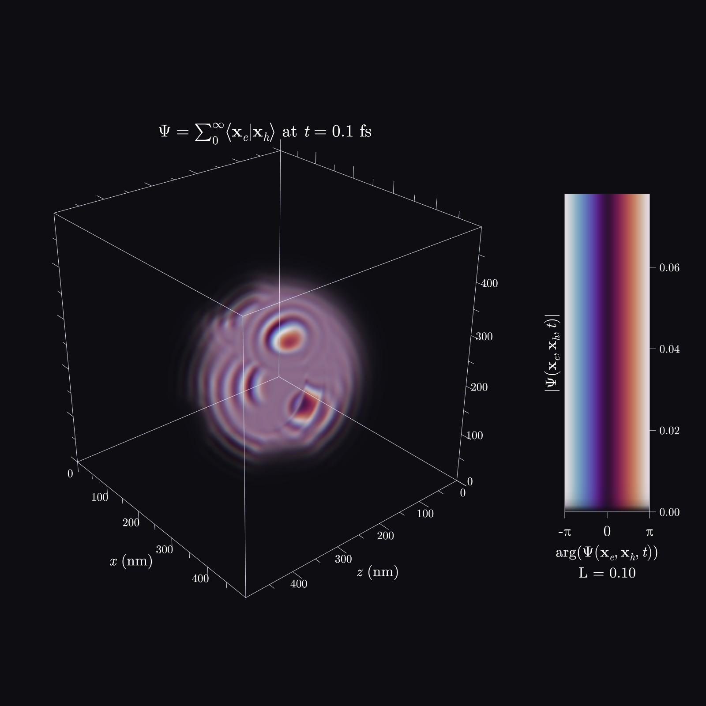

# imaginaryVolumes

Volumetric 3-D plotting of **complex scalar fields** — e.g. quantum-mechanical
wavefunctions — as ray-marched, publication-quality figures. A C++23 / Vulkan
library with both a headless (offscreen) path and an interactive viewer.

A complex field `f(x, y, z) ∈ ℂ` sampled on a grid is rendered by direct volume
ray-marching: the **magnitude** `|f|` drives opacity and the **phase** `arg(f)`
drives colour through a cyclic colormap, so amplitude and phase are read
orthogonally in one image. Over the volume it draws a bounding box, ticked and
labeled axes, and a **phase × magnitude legend**, with labels that support inline
LaTeX-subset math.

<p align="center">
  
</p>

<p align="center"><em>
An electron–hole pair wavefunction Ψ(x<sub>e</sub>, x<sub>h</sub>, t) — a 500³ complex
field — rendered by imaginaryVolumes. Magnitude |Ψ| sets opacity and phase arg(Ψ) sets
colour through the cyclic <code>twilight</code> map, so amplitude and phase are read at once;
the phase × magnitude legend is at right. The title, field name, and axis labels are inline
LaTeX, drawn straight from the <code>iv_view</code> command line.
</em></p>

## Features

- **Complex-field DVR** — ingest `std::complex<float|double>` on a grid (x-fastest);
  magnitude → opacity (linear or logarithmic, with a decade window for
  high-dynamic-range data), phase → colour.
- **Cyclic phase colormaps** — `twilight` (default), analytic `HSV`, `infinity`,
  and `grayscale`, all seamless at ±π.
- **Annotations** — world-space bounding box, ticked/labeled axes, and a
  phase × magnitude colour legend with a thickness-corrected opacity ramp.
- **Typographic labels** — vendored HarfBuzz shaping + GPU (Slug) glyphs for crisp,
  resolution-independent text, including inline `$…$` **LaTeX-subset math**
  (fractions, radicals, scripts, accents, stretchy delimiters, Greek/symbols).
- **Two entry points** — a one-call facade for a headless image or a configured
  interactive viewer.
- **Performance contract** — ~15 ms/frame (~65 FPS) for a 512³ volume at 720p on an
  RTX 4070.

## Requirements

- A C++23 compiler — **GCC ≥ 13**.
- **CMake ≥ 3.25**.
- The **Vulkan SDK** (headers + loader) and **`glslc`** (shader compiler); a
  Vulkan-capable GPU. The interactive viewer also uses GLFW (fetched by the build).

## Build

```sh
cmake -S . -B build/debug
cmake --build build/debug
# run the tests
./build/debug/tests/iv_tests
```

Useful CMake options: `-DCMAKE_BUILD_TYPE=Release` (for the benchmark),
`-DIV_BUILD_VIEWER=OFF` (headless-only, no GLFW), `-DIV_BUILD_TEXT=OFF`
(no HarfBuzz; drops labels/legend). See `docs/` for the development process.

## Usage

### Interactive viewer

```cpp
#include "iv/plot.hpp"
#include <complex>
#include <vector>

int main() {
    iv::GridDims dims{64, 64, 64};                 // x-fastest
    std::vector<std::complex<float>> field(dims.count());
    // ... fill `field` with your complex data ...

    iv::PlotOptions opts;
    opts.axes.title = "$\\psi(x,y,z)$";
    opts.colormapMode = 0;                          // twilight

    auto viewer = iv::makePlot(field, dims, opts);  // Result<iv::vk::Viewer>
    if (viewer) {
        viewer->run();                              // opens a window; orbit/zoom/…
    }
    return 0;
}
```

### Headless render to an image

```cpp
auto image = iv::renderPlot(field, dims, /*width=*/1000, /*height=*/1000, opts);
if (image) {
    // image->width(), image->height(), image->bytes()  (RGBA8, top-left origin)
}
```

### Command-line viewer

The `iv_view` tool loads a raw `complex64` volume (x-fastest):

```sh
cmake --build build/debug --target iv_view
./build/debug/iv_view --input field.c64 --dims 150 150 150 \
    --field '$\psi$' --title '$E = mc^2$' --ylabel y --yunit nm
```

Label flags (`--title`, `--field`, `--{x,y,z}label`, `--{x,y,z}unit`) accept inline
`$…$` math. Keys: drag = orbit, scroll = zoom, `L` = linear/log, `C` = cycle
colormap, `R` = reset, `↑/↓` = density, `←/→` = decade window, `[`/`]` = legend
thickness, `Esc` = quit.

## Project layout

- `include/iv/`, `src/` — the library (host model, Vulkan backend, text/annotation
  layer, plot facade).
- `shaders/` — GLSL compute/overlay shaders (compiled to SPIR-V at build time).
- `tests/` — Catch2 test suite.
- `examples/` — demo programs.
- `docs/adr/` — Architecture Decision Records; `DECISIONS.md` — the decision journal.
  This project is developed under a strict ADR process (`DEV_PROCESS.md`).

## License

MIT — see [LICENSE](LICENSE). Bundled third-party components (HarfBuzz/libharfbuzz-gpu,
the New Computer Modern fonts, Catch2) are under their own permissive licenses; see
[THIRD_PARTY_NOTICES.md](THIRD_PARTY_NOTICES.md).
